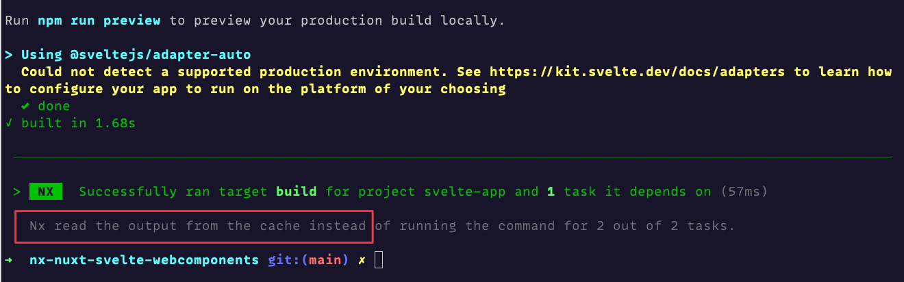

# Nx with Nuxt and Svelte

you can build all apps with `nx run-many --target build` this will execute the build command on every package with a `build` npm script.

Individual apps can be built by running:

```
# nuxt app
nx build nuxt-app

# svelte app
nx build svelte-app
```

Consecutive executions are cached see image



it can be fine-grained what invalidates the cache or not in a `package.json` of a package.

```json
{
  "nx": {
    "targets": {
      "build": {
        "inputs": ["{projectRoot}/src/**/*", "!{projectRoot}/**/*.test.ts"],
        "outputs": ["{projectRoot}/.svelte-kit"]
      }
    }
  }
}
```
